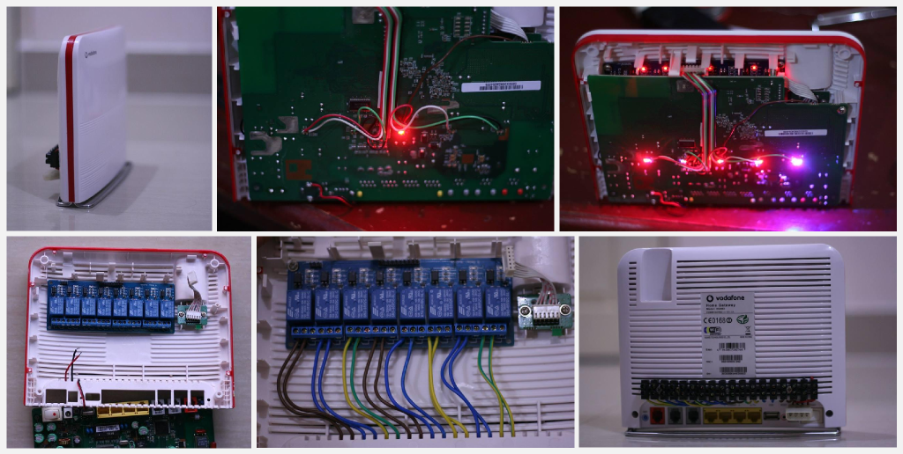
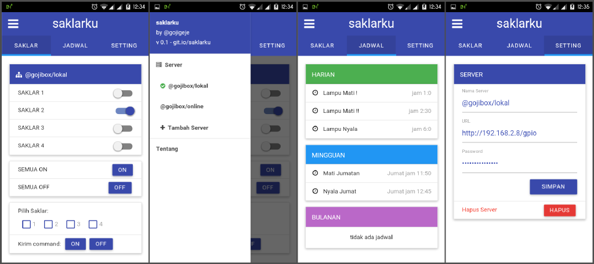

# saklarku

Saklarku adalah aplikasi mobile *remote control* berbasis web untuk mengendalikan saklar atau relay yang terhubung pada port GPIO di perangkat atau router yang berbasis OpenWRT.

Repository ini berisi source code aplikasi client yang dibangun dengan platform PhoneGap (silakan di-*build* sendiri ke platform tujuan Anda) dan script server **saklarku-server** yang harus dipasangkan di router yang hendak dikendalikan.

#### Loncat ke:

1. [Tentang aplikasi client](#client-saklarku-phonegap)
2. [Tentang script saklarku-server](#server-saklarku-server)
3. [Develop & Build di komputer lokal](#develop-build-di-komputer-lokal)
4. [Memasang script saklarku-server di router](#memasang-script-saklarku-server-di-router)
5. [Menghubungkan aplikasi client ke Server](#menghubungkan-aplikasi-client-ke-server)
6. [Berkontribusi](#berkontribusi)

#### Info:

> Dalam pengerjaan project ini, versi OpenWRT yang saya gunakan adalah  Barrier Breaker (14.07, r42625) dan router yang saya pakai adalah Huawei HG553

  
*gambar modifikasi pemasangan relay ke router, oleh Joni Wang - via Group OpenWRT Indonesia (lihat [Credits](#credits))*

## (Client) saklarku-phonegap

* Dapatkan aplikasinya di Google Play Store:  
   https://play.google.com/store/apps/details?id=id.gojigeje.saklarku
* Coba versi online-nya:  
   http://gojigeje.github.io/saklarku



**Fitur:**

* [x] Mode kontrol saklar yang lengkap
* [x] Posisi saklar tersinkronisasi ke semua aplikasi client
* [x] Bisa menambahkan lebih dari 1 server
* [x] Menampilkan jadwal dari crontab
* [x] Ubah parameter server dan hapus server dengan mudah
* [x] Open Source!

**Todo:**

* [ ] Edit nama tiap saklar
* [ ] Menambah jadwal baru

## (Server) saklarku-server

Pada dasarnya, script di server terdiri dari 2 bagian, yaitu:

1. [saklarku-server/gpio/index.php](saklarku-server/gpio/index.php)  
  Script ini merupakan script php yang menjadi *endpoint* parameter URL server di aplikasi client. Script ini akan meneruskan request ke script **gpio.sh** dan mengembalikan outputnya.  
  * Yang perlu diedit:  
    - `$password`, untuk login ke server. (baris 3)
    - `$scriptlocation`, sesuaikan path dengan tempat Anda meletakkan file gpio.sh. (baris 4)

2. [saklarku-server/gpio/script/gpio.sh](saklarku-server/gpio/script/gpio.sh)  
  Script ini merupakan script bash yang bertugas untuk mengubah value/status pada masing-masing LED/GPIO. Script ini mengeluarkan output berupa sintaks JSON.  
  * Yang perlu diedit:
    - Sesuaikan urutan GPIO dengan path masing-masing LED (baris 17-25), hapus yang tidak diperlukan.
    - Sesuikan *array* `GPIOS` dengan jumlah GPIO yang dipakai. (baris 27)

  Script ini juga bisa dijalankan langsung dari *command line*, beri parameter ` help ` untuk menampilkan bantuan:

  ```
  root@gojibox:# ./gpio.sh help

  Cara Pakai:
    ./gpio.sh  [mode] [target] [status]

  Mode:
    toggle, single, group, allon, allof, list, status, startup

  Contoh:
    ./gpio.sh  toggle 1        toggle GPIO ke 1 (ON/OFF)
    ./gpio.sh  single 2 0      set GPIO 2 dengan posisi 0
    ./gpio.sh  group 123 101   set GPIO 1=1, GPIO 2=0, dan GPIO 3=1
    ./gpio.sh  allon           set semua posisi GPIO dengan 1 / ON
    ./gpio.sh  alloff          set semua posisi GPIO dengan 0 / OFF

    ./gpio.sh  list            tampilkan daftar GPIO yang tersedia
    ./gpio.sh  status          tampilkan status masing-masing GPIO

    ./gpio.sh  startup         mengembalikan posisi GPIO saat startup
                               ke posisi terakhir
  ```
  
   Sepertinya output help di atas sudah cukup menjelaskan tentang bagaimana fungsi script gpio.sh ini.

## Develop & Build di Komputer Lokal

Aplikasi client ini berbasis HTML dan JavaScript, dibangun menjadi aplikasi mobile dengan platform phonegap, jadi untuk develop di komputer lokal kira-kira *workflow*-nya seperti berikut:  
(*Silakan merujuk ke http://docs.phonegap.com/ untuk panduan dan dokumentasi yang lebih lengkap*)

1. Install PhoneGap (http://phonegap.com/)
2. Install *PhoneGap Developer App* di device/smartphone untuk testing
3. Clone/Download repo ini
4. Edit source aplikasi di folder [saklarku-phonegap/www/](saklarku-phonegap/www/), oprek sesuka Anda  
5. Testing dengan *PhoneGap Developer App* atau langsung lewat web browser  
   *  *buka file index.html di browser*
6. Build aplikasi ke platform tujuan
   *  *Untuk mem-build aplikasi, Anda harus sudah memasang dan mengatur SDK platform tujuan di komputer lokal*
7. Install hasil build ke device/smartphone

## Memasang Script saklarku-server di Router

Karena script server berbasis PHP dan BASH, maka Anda membutuhkan web server dan BASH shell untuk menjalankannya di router. 

Install web server via ` opkg `. Saya pribadi menggunakan *lighttpd* sebagai web server di router saya, namun Anda bisa menggunakan web server lain seperti *nginx* atau *uhttpd*, yang penting web server tersebut bisa menjalankan script PHP.

Anda juga bisa menginstall BASH langsung dari ` opkg `.

(*Pastikan Anda sudah mengubah password di file __index.php__ dan menyesuaikan daftar GPIO di file __gpio.sh__*)

1. Copy folder **gpio** ([saklarku-server/gpio](saklarku-server/gpio)) ke folder root web server, folder ini akan menjadi *endpoint* parameter URL di aplikasi client  
   * misalnya root web server adalah `/website/`, copy folder `gpio` ke dalamnya, pastikan path file index.php dan file gpio.sh sesuai dengan path berikut:
      * `/website/gpio/index.php`
      * `/website/gpio/script/gpio.sh`

2. Ubah permission file gpio.sh agar bisa dieksekusi  
   `# chmod +x /website/gpio/script/gpio.sh`

3. Sekarang seharusnya script bisa diakses dengan alamat `http://IP_ROUTER/gpio/` dan akan menampilkan error: *unauthorized* karena memang harus diakses dari aplikasi client. Tidak apa-apa, script sudah bisa diakses.

##### **Agar Jadwal di Crontab Bisa Ditampilkan di Aplikasi Client**

Saat ini client bisa mengenali jadwal harian, mingguan dan bulanan. Agar jadwal bisa ditampilkan, maka penulisan jadwal di crontab harus sesuai formatnya:  

> **` * * * * * /full/script/path/to/gpio.sh [parameter] # Nama Jadwal`**  
*- perhatikan bahwa path script ditulis dengan lengkap, dan nama jadwal dipisahkan oleh simbol #*

* Matikan saklar 1 tiap hari jam 6:15 pagi dengan nama "Lampu Mati"  
   ` 15 6 * * *  /website/gpio/script/gpio.sh single 1 0  # Lampu Mati `

* Nyalakan saklar 2 dan 3 tiap hari minggu jam 19:00 malam dengan nama "Pagar dan Taman ON"  
   ` 0 19 * * 6  /website/gpio/script/gpio.sh group 23 11  # Pagar dan Taman ON`

* Matikan saklar 3 dan 4 tanggal 25 tiap bulan, jam 9:30 dengan nama "Tanggal Tua"  
   ` 30 9 25 * * /website/gpio/script/gpio.sh group 34 00 # Tanggal Tua `

(_Anda bisa menggunakan layanan crontab generator agar lebih mudah dalam memahami sintaks crontab: http://crontab-generator.org_)

## Menghubungkan Aplikasi Client ke Server

Setelah berhasil *build* ke platform tujuan dan aplikasi telah terpasang di device/smartphone Anda, saatnya mengakses server dari aplikasi.

1. Pastikan device/smartphone bisa mengakses router.

2. Tambahkan server baru di aplikasi client:  
   * Nama Server: ` terserah `
   * URL Server: ` http://IP_ROUTER/gpio/ `
   * Password: ` sesuaikan `  (*sesuaikan dengan pengaturan sebelumnya*)

3. Selanjutnya aplikasi client akan otomatis menyambungkan ke server dan menampilkan list saklar dan jadwal. Koreksi parameter sebelumnya jika terjadi kegagalan saat menghubungi server.

4. Aplikasi sudah bisa digunakan untuk mengendalikan saklar.

5. Anda bisa menambahkan server dari *slide menu* di sisi kiri aplikasi dan berganti-ganti server dengan memilih salah-satu server di menu tersebut.

## Berkontribusi

Project ini masih terdapat sangat banyak bug, dan banyak kode yang tidak efisien dan bersifat *hacking* (asal bisa jalan). Jadi silakan berkontribusi dalam bentuk apapun agar membantu project ini menjadi lebih baik.

* *Fork* dan ajukan *Pull Request*
* Laporkan *bug* dan berikan saran di form [Issues](issues)
* Kontak saya via telegram: http://telegram.me/gojigeje

## Credits

* Joni Wang (https://www.facebook.com/joniwang)  
   untuk foto modifikasi hardware router Huawei HG553.
* Link ke album foto untuk foto lengkap (*harus gabung ke group dulu*)  
   https://www.facebook.com/media/set/?set=oa.950531958321162
* Group OpenWRT Indonesia (https://www.facebook.com/groups/openwrt)
